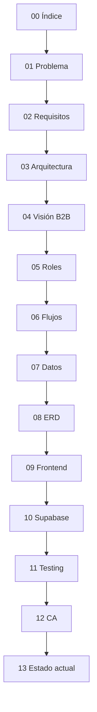

# Documentación técnica BRAINI

**Versión:** 3.0 (narrativa secuencial)  
**Producto:** BrainiFamily B2B invite-only  
**Última revisión:** julio 2026

---

## Propósito

Esta carpeta es la **fuente de verdad** para entender BRAINI: el problema que resuelve, qué debe hacer el software, cómo está montado técnicamente y en qué estado se encuentra hoy. Está pensada para que un desarrollador nuevo pueda leer los documentos **en orden** y llegar a contribuir con contexto completo.

El único `README.md` del repositorio está en la [raíz del proyecto](../README.md) (GitHub). Este archivo es la puerta de entrada a `docs/`.

---

## Mapa de documentos

| # | Documento | Qué explica |
|---|-----------|-------------|
| 00 | [INDICE](00-INDICE.md) | Este mapa, convenciones y orden de lectura |
| 01 | [PROBLEMA Y CONTEXTO](01-PROBLEMA-Y-CONTEXTO.md) | Reto emocional en centros, actores, por qué existe BRAINI |
| 02 | [REQUISITOS](02-REQUISITOS.md) | FR/NFR unificados (funcional + no funcional) |
| 03 | [ARQUITECTURA Y STACK](03-ARQUITECTURA-Y-STACK.md) | Por qué SPA Vite, Supabase, capas, decisiones |
| 04 | [VISIÓN Y ALCANCE B2B](04-VISION-Y-ALCANCE-B2B.md) | Invite-only, principios, fuera de alcance v2.0 |
| 05 | [ROLES Y PERMISOS](05-ROLES-Y-PERMISOS.md) | Matrices por rol; RLS contrastada con Supabase remoto |
| 06 | [FLUJOS ONBOARDING E INVITACIONES](06-FLUJOS-ONBOARDING-E-INVITACIONES.md) | Pipeline SA→DIR→TCH→padre, multi-hijo, casos borde |
| 07 | [MODELO DE DATOS](07-MODELO-DE-DATOS.md) | Tablas, enums, triggers, reglas (validado vía MCP) |
| 08 | [ERD](08-ERD.md) | Diagrama Mermaid y cardinalidades |
| 09 | [DISEÑO TÉCNICO FRONTEND](09-DISENO-TECNICO-FRONTEND.md) | `src/app`, `products`, `shared`, `integrations` |
| 10 | [BACKEND SUPABASE](10-BACKEND-SUPABASE.md) | Auth, RPC, Edge Functions, RLS, Storage |
| 11 | [TESTING Y CALIDAD](11-TESTING-Y-CALIDAD.md) | Pirámide, scripts, MSW, E2E, baseline bundle |
| 12 | [CRITERIOS DE ACEPTACIÓN](12-CRITERIOS-DE-ACEPTACION.md) | CA-* y checklist de entrega |
| 13 | [ESTADO ACTUAL](13-ESTADO-ACTUAL.md) | Stack real, modernización, gaps conocidos |

---

## Orden de lectura recomendado

**Rutas rápidas por perfil:**

| Perfil | Lectura mínima |
|--------|----------------|
| Producto / negocio | 01 → 04 → 06 → 12 |
| Backend / Supabase | 02 → 07 → 08 → 10 → 13 |
| Frontend | 02 → 03 → 09 → 11 |
| QA | 02 → 11 → 12 |

---

## Convenciones del dominio

| Término | Significado |
|---------|-------------|
| **Rol** | `super_admin`, `director`, `teacher` o `parent` — un usuario, un rol |
| **Centro** | Fila en `schools`; contenedor de directores, teachers, clases y alumnado |
| **Invitación** | Enlace con token UUID; único mecanismo de alta (no hay signup público) |
| **Catálogo pedagógico** | `missions`, `activities`, `medals` — solo lectura en producción; lo gestiona desarrollo |
| **Menor** | Fila en `children`; sin cuenta propia; progreso vía cuenta del padre |

**Tablas de invitación:** `director_invited`, `teacher_invited`, `parent_invited` (no `*_invites`).

**Super admin:** email en `admin_emails`; no aparece en `user_roles`.

---

## Validación con Supabase (MCP)

Los documentos **05, 07, 08, 10 y 13** contrastan el esquema y políticas del proyecto remoto **BRAINI** (`igwoavsazbycqmdweger`, región `eu-west-2`) consultado en solo lectura vía MCP. Si hay divergencia entre documentación antigua y el remoto, prevalece el remoto y el gap queda anotado en [13-ESTADO-ACTUAL](13-ESTADO-ACTUAL.md).

---

## Fuera de alcance v2.0 (resumen)

- Autoregistro `/brainifamily/signup`, waitlist, Test Genius, Conferencia
- Emails transaccionales automáticos (enlace manual por ahora)
- Edición de misiones/actividades por usuarios de la plataforma
- Apps nativas, facturación, CRM, LMS

Detalle completo en [04-VISION-Y-ALCANCE-B2B](04-VISION-Y-ALCANCE-B2B.md).
