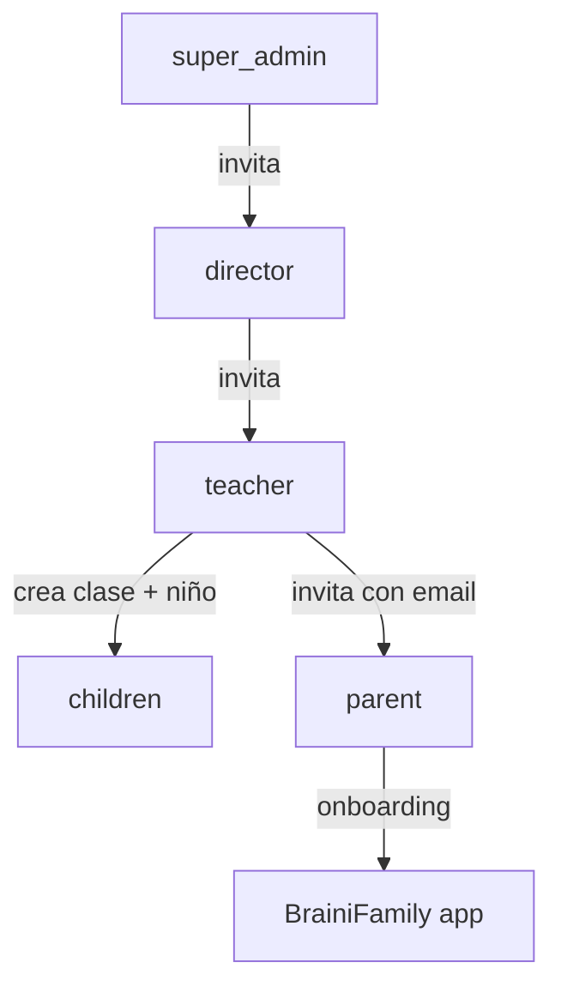
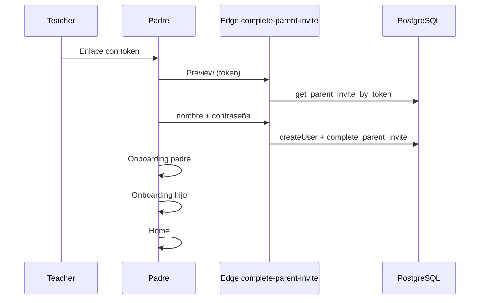

# Onboarding por rol — BRAINI

**Versión:** 2.0

Este documento describe el **recorrido completo** de cada rol desde la invitación hasta el uso habitual de la plataforma.

---

## 1. Diagrama general del pipeline

---

## 2. Super admin

### 2.1 Alta inicial

El super admin es un email listado en `admin_emails`. No hay flujo de invitación; se configura directamente en base de datos.

### 2.2 Primer acceso

1. Login en `/brainifamily/login`.
2. `get_my_role()` devuelve `super_admin`.
3. Redirección a `/brainifamily/admin`.

### 2.3 Operaciones habituales

| Acción | Descripción |
|--------|-------------|
| Crear centro | RPC `admin_create_school` |
| Invitar director | RPC `create_director_invite` → enlace `/brainifamily/invite/director?token=...` |
| Ver / modificar / eliminar | Centros, directores, teachers, clases, alumnos, invitaciones (ámbito global) |

### 2.4 Invitación director

1. Super admin introduce email del futuro director.
2. **Validación:** el sistema comprueba si el email ya existe como usuario (cualquier rol).
3. Si no existe → genera token (caducidad 15 días) → copia enlace manualmente.
4. El director abre el enlace → formulario: nombre + contraseña.
5. Edge Function `complete-director-invite` → Auth + RPC `complete_director_invite`.
6. Redirección a login (activación completada).

---

## 3. Director

### 3.1 Activación por invitación

1. Abre enlace `/brainifamily/invite/director?token=...`.
2. Preview: centro, email, caducidad.
3. Introduce **nombre** y **contraseña** (mín. 6 caracteres).
4. Se crea cuenta Auth + filas en `user_roles` (`director`) y `directors`.
5. Invitación → `status = completed`.

### 3.2 Acceso posterior

1. Login → `get_my_role()` → `director`.
2. Redirección a `/brainifamily/director`.

### 3.3 Operaciones en su centro

| Acción | Descripción |
|--------|-------------|
| Invitar teacher | RPC `create_teacher_invite` → enlace `/brainifamily/invite/teacher?token=...` |
| CRUD teachers | Alta/baja/modificación dentro de su `school_id` |
| Ver clases, alumnos, invitaciones | Solo lectura o gestión según [04-ROLES-Y-PERMISOS.md](./04-ROLES-Y-PERMISOS.md) |
| Ver progreso de alumnos | Solo lectura (todo el centro) |

### 3.4 Invitación teacher

1. Director introduce email.
2. **Validación de email existente** obligatoria antes de generar enlace.
3. Si el email ya es usuario de la plataforma → **no se genera invitación**; mensaje claro al director.
4. Si es nuevo → token 15 días → enlace manual.

---

## 4. Teacher

### 4.1 Activación por invitación

1. Abre enlace `/brainifamily/invite/teacher?token=...`.
2. Preview: centro, email, caducidad.
3. Introduce **nombre** y **contraseña**.
4. Edge Function `complete-teacher-invite` → Auth + RPC `complete_teacher_invite`.
5. Se crean `user_roles` (`teacher`) y `teachers` con `school_id`.

### 4.2 Acceso posterior

1. Login → `get_my_role()` → `teacher`.
2. Redirección a `/brainifamily/teacher`.

### 4.3 Configuración inicial: clases

| Campo | Obligatorio | Notas |
|-------|-------------|-------|
| `name` | Sí | Único por teacher |
| `course_id` | Sí | FK a `courses` |
| `nivel_educativo` | Sí | Enum; validado con `course_id` |
| `academic_year` | No | Texto libre opcional |

### 4.4 Alta de alumno

| Campo | Obligatorio al crear | Notas |
|-------|---------------------|-------|
| `nombre` | Sí | Mín. 2 caracteres |
| `apellidos` | No | |
| `class_id` | Sí | Clase del teacher |
| Email padre | No al crear | Obligatorio solo para **generar enlace** |

Al insertar en `children`:

- `parent_id = NULL`
- `profile_completed = false`
- Trigger `children_sync_from_class` copia `school_id`, `course_id`, `nivel_educativo` desde la clase.
- Trigger `setup_child` inicializa `child_missions` y `child_activities`.

El teacher puede crear el alumno **sin email** y generar la invitación **después**, pero `create_parent_invite` **requiere email** para emitir el token.

### 4.5 Invitación al padre

1. Teacher introduce email del padre/tutor.
2. **Validación de email existente:**
   - Si ya es **parent** → se genera invitación para vincular nuevo hijo (flujo segunda invitación).
   - Si ya es **teacher/director** → **rechazar** (un email = un rol).
   - Si no existe → invitación de alta nueva.
3. RPC `create_parent_invite` → revoca `pending` anterior del mismo `child_id`.
4. Token 15 días → enlace `/brainifamily/invite/parent?token=...`.
5. Teacher copia y comparte manualmente.

---

## 5. Padre / tutor

### 5.1 Primera invitación (cuenta nueva)

**Paso 1 — Activación (enlace):**

- Preview: nombre del niño, centro, email invitado, caducidad.
- Introduce **contraseña** (mín. 6 caracteres) y opcionalmente **nombre** de perfil.
- Se crea cuenta Auth + `user_roles` (`parent`) + `parents` + vínculo `children.parent_id`.

**Paso 2 — Onboarding padre** (`/brainifamily/parents-profile`):

| Campo | Obligatorio |
|-------|-------------|
| `nombre` | Sí |
| `relacion_con_menor` | Sí |
| `email` | Sí (precargado desde invitación; solo lectura) |
| `apellidos` | No |
| `telefono_contacto` | No |

**Paso 3 — Onboarding hijo** (`/brainifamily/child-profile`):

| Campo | Obligatorio | Notas |
|-------|-------------|-------|
| `nombre` | Validar | Teacher ya lo introdujo; padre puede corregir |
| `apellidos` | Validar | Idem |
| `genero` | Sí | Padre debe completar |
| `fecha_nacimiento` | Sí | Padre debe completar |
| `nivel_educativo` | Solo lectura | Heredado de la clase |

Al completar → `profile_completed = true` → `/brainifamily/home`.

### 5.2 Segunda invitación (mismo email, otro hijo)

1. Abre nuevo enlace con token.
2. Sistema detecta cuenta existente.
3. Pantalla: «Ya tienes cuenta. Inicia sesión para vincular a [Nombre hijo]».
4. Login con email + contraseña (sin nueva contraseña de registro).
5. Edge Function completa invitación con sesión activa.
6. **Se salta onboarding padre** (ya completado).
7. Onboarding hijo si `profile_completed = false` para ese niño.
8. Home con selector multi-hijo.

### 5.3 Acceso habitual

1. Login en `/brainifamily/login`.
2. Si no existe cuenta → **error** («Email o contraseña incorrectos» / mensaje de contacto con centro).
3. `get_my_role()` → `parent`.
4. Si hay hijos con perfil incompleto → onboarding hijo pendiente.
5. Home con selector de hijo activo (muestra colegio de cada uno).

### 5.4 Uso del programa

- Misiones y actividades (vía cuenta padre, hijo seleccionado en contexto).
- Diario emocional.
- Tests de inteligencia emocional (TMMS padres, test emocional niños).
- Perfil editable en `/brainifamily/profile`.

---

## 6. Resumen de redirecciones post-login

| Rol | Destino |
|-----|---------|
| `super_admin` | `/brainifamily/admin` |
| `director` | `/brainifamily/director` |
| `teacher` | `/brainifamily/teacher` |
| `parent` | Onboarding pendiente o `/brainifamily/home` |
| Sin rol / sin cuenta | Error en login |

---

## 7. Validación de email en invitaciones

**Regla transversal:** antes de generar cualquier enlace (director, teacher, parent), el sistema consulta si el email ya está registrado.

| Situación | Acción |
|-----------|--------|
| Email libre | Generar invitación |
| Email = `parent` existente + invitación padre | Permitir (vincular otro hijo) |
| Email = `teacher` / `director` / otro rol + invitación distinta | **Rechazar** con mensaje |
| Email en invitación `pending` no caducada | Política según tipo (revocar/regenerar) |

Implementación técnica en [08-TDD.md](./08-TDD.md).
