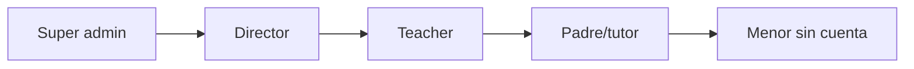

# Problema y contexto — BRAINI

**Versión:** 3.0

---

## 1. El reto educativo

Los centros de Educación Infantil y Primaria (niños de aproximadamente 3 a 12 años) necesitan herramientas que ayuden a las familias a trabajar la **inteligencia emocional** y el **neurobienestar** fuera del aula, con continuidad entre escuela y hogar.

Los retos concretos:

- **Brecha emocional:** muchas familias no tienen un marco estructurado para hablar de emociones con sus hijos.
- **Desconexión escuela–familia:** los docentes ven al alumnado en el centro, pero el seguimiento emocional en casa queda fragmentado.
- **Falta de continuidad:** sin un programa secuencial y medible, las intervenciones emocionales son puntuales y difíciles de evaluar.
- **Complejidad organizativa:** un centro tiene directores, varios teachers, múltiples clases y familias; hace falta un sistema que respete jerarquías y ámbitos de acceso.

BRAINI nace para cerrar ese ciclo: el centro adopta el programa, los docentes invitan a las familias, y las familias consumen misiones, actividades, diario emocional y tests desde casa.

---

## 2. Qué es BRAINI

BRAINI es una **plataforma multi-producto** de neurobienestar e inteligencia emocional:

| Producto | Ruta | Función |
|----------|------|---------|
| **Hub** | `/` | Punto de entrada; presenta las líneas de producto |
| **Braini Kids** | `/brainikids` | Placeholder «en desarrollo» (línea infantil) |
| **Braini Juniors** | `/brainijuniors` | Placeholder «en desarrollo» (línea junior) |
| **BrainiFamily** | `/brainifamily/*` | App B2B operativa — núcleo del sistema |

El **núcleo transaccional** es BrainiFamily:

- Programa secuencial de **misiones (sesiones)** y **actividades** gamificadas.
- **Diario emocional** por hijo.
- **Tests de inteligencia emocional** (TMMS padres, test emocional niños).
- Paneles de **super admin**, **director** y **teacher** para gestión del centro.
- Experiencia de **padre/tutor** para consumo del programa y seguimiento del progreso del menor.

---

## 3. Modelo de despliegue B2B

BRAINI no se vende directamente al consumidor final en v2.0. El despliegue es **B2B invite-only**:

1. Un **super admin** da de alta centros educativos.
2. Cada centro recibe **directores** por invitación.
3. Los directores invitan **teachers**.
4. Los teachers crean clases y alumnos, e **invitan padres**.
5. Los padres activan su cuenta y consumen el programa.

No existe autoregistro público. Todo acceso pasa por un **enlace de invitación** con token de 15 días.

---

## 4. Actores y sus motivaciones

| Actor | Motivación | Interacción con BRAINI |
|-------|------------|------------------------|
| **Visitante** | Conocer el producto | Landings + login |
| **Super admin** | Operar la plataforma globalmente | Panel admin; crear centros; invitar directores |
| **Director** | Gestionar su centro | CRUD teachers, clases, alumnos; ver progreso (lectura) |
| **Teacher** | Gestionar sus clases y familias | CRUD clases/alumnos; invitar padres; ver progreso (lectura) |
| **Padre/tutor** | Acompañar al menor en casa | Programa, diario, tests, perfiles |
| **Menor** | — | Sin cuenta; progreso vía cuenta del padre |
| **Sistema** | Persistencia y seguridad | Supabase (Auth, PostgreSQL, Storage, Edge Functions) |

---

## 5. Principios que condicionan el diseño

Estos principios (detallados en [04-VISION-Y-ALCANCE-B2B](04-VISION-Y-ALCANCE-B2B.md)) derivan directamente del problema:

1. **Invite-only:** sin autoregistro; un email = un rol.
2. **Jerarquía de centro:** super_admin → director → teacher → padre.
3. **Separación padre/teacher:** el teacher gestiona datos estructurales antes de vincular; el padre completa perfil y consume el programa.
4. **Multi-hijo y multi-centro:** una cuenta padre puede tener varios hijos en centros distintos.
5. **Catálogo inmutable:** misiones, actividades y medallas las gestiona desarrollo, no los usuarios.
6. **Progreso en base de datos:** la progresión de misiones y medallas la orquestan triggers PostgreSQL, no lógica ad hoc en el cliente.

---

## 6. Cumplimiento y confianza

- Acuerdos con el centro educativo como responsable del despliegue.
- Aviso de privacidad y consentimiento del padre al activar la invitación.
- Datos de menores gestionados por el padre/tutor vinculado; el menor no tiene credenciales propias.

---

## 7. Criterios de éxito del producto

Un despliegue exitoso demuestra:

- Ciclo completo: admin → director → teacher → padre → actividad completada con persistencia.
- Padre con 2+ hijos (mismo o distinto centro) desde una sola cuenta.
- Teacher ve progreso de alumnos sin poder modificarlo.
- Login sin cuenta previa devuelve error claro (no crea cuenta fantasma).
- Sin rutas de autoregistro accesibles.

Los criterios verificables están en [12-CRITERIOS-DE-ACEPTACION](12-CRITERIOS-DE-ACEPTACION.md).

---

## 8. Siguiente lectura

- [02-REQUISITOS](02-REQUISITOS.md) — qué debe hacer el software (FR/NFR).
- [04-VISION-Y-ALCANCE-B2B](04-VISION-Y-ALCANCE-B2B.md) — principios y límites del producto.
