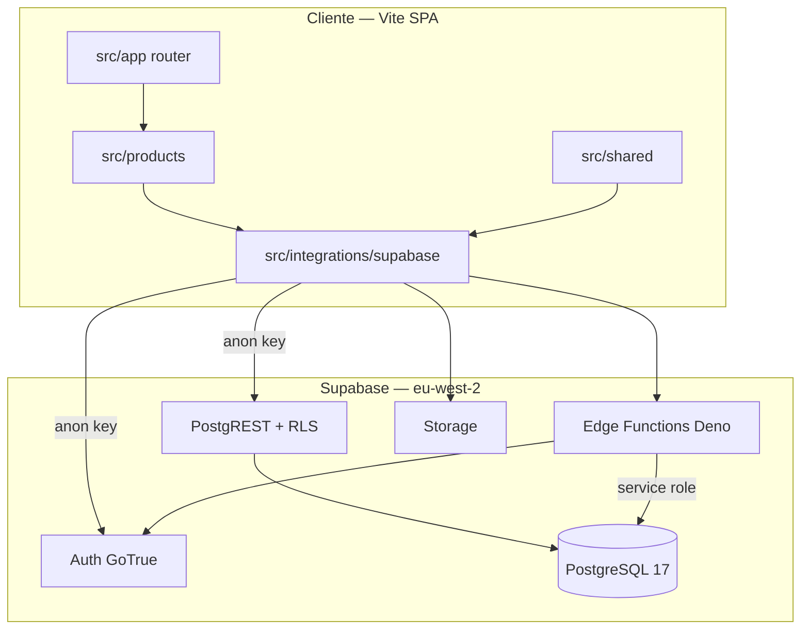

# Arquitectura y stack — BRAINI

**Versión:** 3.0  
**Estado:** alineado a `develop`, julio 2026

---

## 1. Vista general

BRAINI es una **SPA (Single Page Application)** servida como sitio estático. El navegador habla con Supabase vía HTTPS usando la clave anónima; la autorización fina la resuelven **RLS** y **RPC SECURITY DEFINER** en PostgreSQL.



---

## 2. Por qué SPA con Vite (y no Next.js)

| Factor | Decisión |
|--------|----------|
| Naturaleza del producto | App autenticada B2B; landings estáticas; sin SEO crítico en rutas privadas |
| Backend | Supabase ya expone Auth, API y Edge; no hace falta BFF en Node |
| Despliegue | Hosting estático en Vercel; rewrites SPA en `vercel.json` |
| Rendimiento | Code splitting con `React.lazy` + chunks por vendor y actividades |
| Complejidad | Evitar SSR/hidratación duplicada; un solo runtime React en cliente |

Next.js aportaría valor si hubiera rendering server-side masivo, rutas API propias o SEO dinámico. BRAINI concentra la lógica de negocio en Supabase y el frontend es principalmente UI + orquestación.

---

## 3. Stack tecnológico (real)

| Capa | Tecnología | Versión (package.json) |
|------|------------|------------------------|
| UI | React | 19.2.7 |
| Bundler | Vite | 8.1.4 |
| Estilos | Tailwind CSS | 4.3.2 (`@tailwindcss/vite`) |
| Routing | React Router | 7.18.1 |
| Datos | TanStack React Query | 5.87.1 |
| Componentes | Radix UI + shadcn pattern | — |
| Notificaciones | Sonner | 1.5.0 |
| Backend | Supabase JS | 2.49.8 |
| Tests unit | Vitest + RTL + MSW | 4.1.10 |
| Tests E2E | Playwright | 1.61.1 |
| Lenguaje | TypeScript | 5.5.3 |
| Runtime dev | Node | 20.19+ / 22.12+ |

---

## 4. Estructura del repositorio

```
BRAINI/
├── docs/                    # Documentación (este índice)
├── public/                  # Assets estáticos (logos, etc.)
├── src/
│   ├── app/                 # Bootstrap, router, providers globales
│   ├── products/            # Lógica por producto (hub, brainifamily, landings)
│   ├── shared/              # UI, navegación, guards, utilidades
│   ├── integrations/        # Cliente Supabase, queries, RPC, edge helpers
│   └── styles/              # CSS global (Tailwind 4)
├── supabase/
│   └── functions/           # Edge Functions (3 complete-*-invite)
├── tests/
│   ├── setup/               # Vitest, MSW
│   ├── fixtures/
│   └── e2e/                 # Playwright smoke
├── package.json
└── vercel.json
```

**Monorepo-lite:** cada producto vive en `src/products/<nombre>/` con sus páginas, features y hooks. Lo compartido sube a `shared/`; el acceso a Supabase se centraliza en `integrations/`.

---

## 5. Capas del frontend

| Capa | Responsabilidad | Ejemplo |
|------|-----------------|---------|
| `app/` | Router, lazy routes, guards de ruta | `router.tsx`, `ProtectedRoute` |
| `products/` | UX por dominio de negocio | `brainifamily/pages/teacher/` |
| `shared/` | Design system, navegación, constantes | `shared/ui/button.tsx` |
| `integrations/` | Contrato con Supabase | `queries/children.ts`, `rpc/invites.ts` |

**Flujo de datos típico (padre):**

1. Página monta hook con React Query.
2. Hook llama a `integrations/supabase/queries/*`.
3. Query usa cliente tipado (`database.types.ts`).
4. RLS filtra por `auth.uid()` en el servidor.
5. UI renderiza; mutaciones invalidan caché.

---

## 6. Autenticación y autorización

| Nivel | Mecanismo |
|-------|-----------|
| Identidad | Supabase Auth (email + contraseña) |
| Rol | RPC `get_my_role()` → `super_admin` \| `director` \| `teacher` \| `parent` |
| Rutas | Guards React: `AdminRoute`, `DirectorRoute`, `TeacherRoute`, `ProtectedRoute` |
| Datos | RLS en PostgreSQL + helpers `is_super_admin()`, `teacher_owns_child()`, `director_in_child_school()` |

Alta de usuarios: **solo** Edge Functions con `service_role` + RPC `complete_*_invite`. No hay `signUp` público en el cliente.

---

## 7. Code splitting y rendimiento

Implementado en Fase 1 (ver [13-ESTADO-ACTUAL](13-ESTADO-ACTUAL.md)):

- **Lazy routes:** cada página es `React.lazy()` en `router.tsx`.
- **Vendor chunks:** React, Supabase, Radix separados en build Vite.
- **Registry de actividades:** `features/activities/content/registry.ts` carga puzzles bajo demanda.
- **Baseline:** index JS pasó de ~1.1 MB monolítico a ~107 KB (ver [11-TESTING](11-TESTING-Y-CALIDAD.md)).

---

## 8. Variables de entorno

| Variable | Dónde | Uso |
|----------|-------|-----|
| `VITE_SUPABASE_URL` | Frontend | URL del proyecto |
| `VITE_SUPABASE_ANON_KEY` | Frontend | Clave pública |
| `SUPABASE_SERVICE_ROLE_KEY` | Edge Functions | Admin Auth + RPC privilegiadas |

---

## 9. Despliegue

- **Frontend:** Vercel — build `npm run build`, output `dist/`, rewrites SPA.
- **Backend:** Supabase Cloud — proyecto `igwoavsazbycqmdweger` (eu-west-2).
- **Edge Functions:** desplegadas en Supabase; código fuente en `supabase/functions/`.

---

## 10. Decisiones explícitas

| Decisión | Alternativa descartada | Motivo |
|----------|------------------------|--------|
| BaaS Supabase | API Node propia | Menor superficie operativa; RLS nativo |
| Triggers para progreso | Solo lógica frontend | Consistencia y auditoría en BD |
| Invite-only | Signup + waitlist | Modelo B2B por centro |
| MSW en tests | Supabase remoto en unit | Aislamiento, velocidad, sin datos reales |
| Sonner vs Radix Toast | — | Menos boilerplate; migración Fase 2 |

---

## 11. Siguiente lectura

- [09-DISENO-TECNICO-FRONTEND](09-DISENO-TECNICO-FRONTEND.md) — detalle de rutas, guards y registry.
- [10-BACKEND-SUPABASE](10-BACKEND-SUPABASE.md) — RPC, Edge, RLS verificados en remoto.
