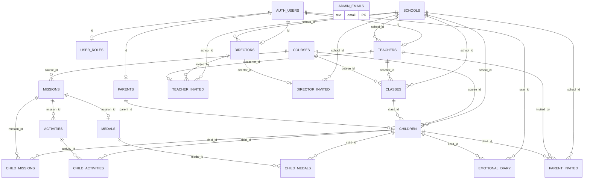

# ERD — Entity Relationship Diagram

**Versión:** 2.0  
**Esquema:** PostgreSQL `public` + referencia a `auth.users`  
**Proyecto Supabase:** BRAINI (`igwoavsazbycqmdweger`)

---

## 1. Diagrama (Mermaid)

---

## 2. Convenciones de nombres

- Tablas de invitación: `director_invited`, `teacher_invited`, `parent_invited` (no `*_invites`).
- Super admin: tabla `admin_emails` (no `platform_admin_emails`).
- `children.parent_id` es **nullable** hasta completar invitación padre.

---

## 3. Cardinalidades clave

| Relación | Cardinalidad |
|----------|--------------|
| schools → directors | 1:N (varios directores por centro) |
| schools → teachers | 1:N |
| teachers → classes | 1:N |
| classes → children | 1:N |
| parents → children | 1:N (sin límite; multi-centro permitido) |
| children → parent_invited | 1:N histórico; 1 pending vigente |
| missions → activities | 1:N |
| missions → medals | 1:1 |

---

## 4. Tablas por dominio

### Identidad y acceso (5)

`admin_emails`, `user_roles`, `parents`, `teachers`, `directors`

### Organización (2)

`schools`, `classes`

### Invitaciones (3)

`director_invited`, `teacher_invited`, `parent_invited`

### Alumnado (1)

`children`

### Catálogo pedagógico (4)

`courses`, `missions`, `activities`, `medals`

### Progreso (3)

`child_missions`, `child_activities`, `child_medals`

### Diario (1)

`emotional_diary`

**Total: 19 tablas en `public`.**

---

## 5. Objetos de lógica (no tablas)

### Funciones RPC (SECURITY DEFINER)

| Función | Propósito |
|---------|-----------|
| `get_my_role` | Rol + school_id del usuario autenticado |
| `is_super_admin` | Comprueba `admin_emails` |
| `admin_create_school` | Alta de centro |
| `create_director_invite` | Invitación director |
| `create_teacher_invite` | Invitación teacher |
| `create_parent_invite` | Invitación padre |
| `get_director_invite_by_token` | Preview invitación |
| `get_teacher_invite_by_token` | Preview invitación |
| `get_parent_invite_by_token` | Preview invitación (+ child_nombre) |
| `complete_director_invite` | Activar director |
| `complete_teacher_invite` | Activar teacher |
| `complete_parent_invite` | Activar/vincular padre |
| `upsert_emotional_diary` | CRUD diario |

### Triggers

| Trigger | Tabla | Función |
|---------|-------|---------|
| `trg_children_sync_from_class` | children | Hereda datos de clase |
| `trg_classes_propagate_to_children` | classes | Propaga cambios a alumnos |
| `trg_validate_class_course_nivel` | classes | Valida curso/nivel |
| `trigger_setup_child` | children | Inicializa progreso |
| `trigger_complete_mission` | child_activities | Avanza misiones/medallas |

### Edge Functions (Deno)

| Función | Propósito |
|---------|-----------|
| `complete-director-invite` | Auth Admin + RPC |
| `complete-teacher-invite` | Auth Admin + RPC |
| `complete-parent-invite` | Auth Admin / sesión + RPC |

---

## 6. Tablas eliminadas (no recrear)

| Tabla | Motivo |
|-------|--------|
| `waitlist` | Fuera de producto v2.0 |
| `test_genius_evaluations` | Fuera de producto v2.0 |
| `platform_admin_emails` | Renombrada a `admin_emails` |

---

## 7. Referencias cruzadas

- Reglas de negocio: [05-MODELO-DATOS.md](./05-MODELO-DATOS.md)
- Permisos: [04-ROLES-Y-PERMISOS.md](./04-ROLES-Y-PERMISOS.md)
- Arquitectura: [08-TDD.md](./08-TDD.md)
