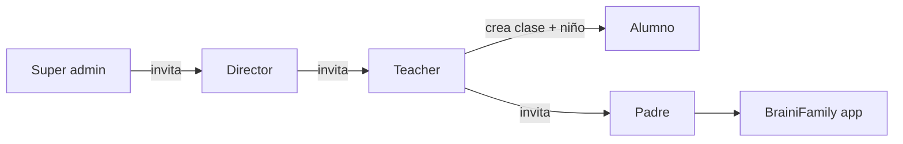

# Flujos de onboarding e invitaciones — BRAINI

**Versión:** 3.0  
**Fusión de:** onboarding por rol, multi-hijo e invitaciones, teacher/clases/niños

---

## 1. Pipeline general



---

## 2. Super admin

### Alta

- Email en `admin_emails` (configuración BD; sin invitación).
- Primer acceso: login → `get_my_role()` = `super_admin` → `/brainifamily/admin`.

### Operaciones

| Acción | Detalle |
|--------|---------|
| Crear centro | RPC `admin_create_school(p_name)` |
| Invitar director | RPC `create_director_invite` → `/brainifamily/invite/director?token=...` |
| Ver/modificar/eliminar | Centros, directores, teachers, clases, alumnos, invitaciones (global) |

### Flujo invitación director

1. Introduce email del director.
2. Valida email no existente con rol incompatible (`email_platform_status`).
3. Si nuevo → token UUID, caducidad 15 días → copia enlace manual.
4. Director abre enlace → preview (centro, email, caducidad) → nombre + contraseña (mín. 6).
5. Edge `complete-director-invite` → `auth.admin.createUser` → RPC `complete_director_invite`.
6. Redirección a login.

---

## 3. Director

### Activación

- Enlace `/brainifamily/invite/director?token=...`
- Edge + RPC crean: Auth user, `user_roles`(director), `directors`(school_id), invitación `completed`.

### Acceso posterior

Login → `director` → `/brainifamily/director`.

### Operaciones

| Acción | Detalle |
|--------|---------|
| Invitar teacher | RPC `create_teacher_invite` → `/brainifamily/invite/teacher?token=...` |
| CRUD teachers | Dentro de su `school_id` |
| CRUD clases y alumnos | De su centro |
| Ver progreso | Solo lectura (todo el centro) |

---

## 4. Teacher

### Activación

- Enlace `/brainifamily/invite/teacher?token=...`
- Edge `complete-teacher-invite` → RPC `complete_teacher_invite` → `user_roles`(teacher) + `teachers`.

### Crear clase

| Campo | Obligatorio | Notas |
|-------|-------------|-------|
| `name` | Sí | Único por teacher |
| `course_id` | Sí | FK `courses` |
| `nivel_educativo` | Sí | Enum; validado con `course_id` (trigger) |
| `academic_year` | No | Texto libre |
| `school_id`, `teacher_id` | Auto | De `teachers` y sesión |

### Alta alumno

| Campo | Obligatorio crear | Notas |
|-------|-------------------|-------|
| `nombre` | Sí | Mín. 2 caracteres |
| `apellidos` | No | |
| `class_id` | Sí | Clase del teacher |
| Email padre | No al crear | Obligatorio solo para generar enlace |

Al insertar `children`:

- `parent_id = NULL`, `profile_completed = false`
- Trigger `children_sync_from_class` → hereda `school_id`, `course_id`, `nivel_educativo`
- Trigger `setup_child` → crea `child_missions` y `child_activities`

### Edición teacher

| Momento | ¿Editar? |
|---------|----------|
| `parent_id IS NULL` | Sí: nombre, apellidos, clase |
| Tras vincular padre | No (solo padre) |

### Invitación padre

1. Teacher introduce email del padre.
2. Validación: si ya `parent` → vincular nuevo hijo; si `teacher`/`director` → rechazar.
3. RPC `create_parent_invite(child_id, email)` → revoca `pending` anterior del mismo `child_id`.
4. Token 15 días → `/brainifamily/invite/parent?token=...`
5. Copia manual del enlace.

**Estados en dashboard teacher:**

| Estado | Significado |
|--------|-------------|
| Sin invitación | Alumno sin email / sin enlace generado |
| `pending` | Enlace generado, no activado |
| `completed` | Padre vinculado |
| `expired` / `revoked` | Regenerar |

### Visualización progreso (solo lectura)

Datos desde `child_missions`, `child_activities`, `child_medals`, `emotional_diary`, `children`.

---

## 5. Padre / tutor

### Primera invitación (secuencia completa)

```
Enlace teacher → Edge complete-parent-invite → onboarding padre → onboarding hijo → home
```

**Paso 1 — Activación:** preview (niño, centro, email, caducidad) → contraseña (mín. 6) + nombre opcional → Auth + `user_roles`(parent) + `parents` + `children.parent_id`.

**Paso 2 — Onboarding padre** (`/brainifamily/parents-profile`):

| Campo | Obligatorio |
|-------|-------------|
| `nombre` | Sí |
| `relacion_con_menor` | Sí |
| `email` | Sí (precargado, solo lectura) |
| `apellidos` | No |
| `telefono_contacto` | No |

**Paso 3 — Onboarding hijo** (`/brainifamily/child-profile`):

| Campo | Obligatorio | Notas |
|-------|-------------|-------|
| `nombre` | Validar | Teacher lo introdujo; padre corrige |
| `apellidos` | Validar | Idem |
| `genero` | Sí | Padre completa |
| `fecha_nacimiento` | Sí | Padre completa |
| `nivel_educativo` | Solo lectura | Heredado de clase |

Completar → `profile_completed = true` → `/brainifamily/home`.

### Segunda invitación (mismo padre, otro hijo)

1. Abre enlace con token.
2. Preview del niño + centro.
3. Sistema detecta cuenta existente.
4. «Ya tienes cuenta. Inicia sesión para vincular [Nombre hijo]».
5. `signInWithPassword` o sesión activa → Edge completa sin `createUser`.
6. Salta onboarding padre → onboarding hijo si `profile_completed = false` → home multi-hijo.

### Acceso habitual

- Login en `/brainifamily/login`.
- Sin cuenta → error claro.
- `get_my_role()` → parent.
- Hijos con `profile_completed = false` → onboarding pendiente.
- Home con selector de hijo (muestra colegio de cada uno).

### Uso del programa

Misiones/actividades, diario emocional, tests TMMS/test niños, perfil en `/brainifamily/profile`.

---

## 6. Multi-hijo y multi-centro

### Modelo mental

- Cada niño = su propia invitación (token/enlace).
- Mismo email = varias invitaciones (una por hijo).
- Contraseña = cuenta padre (no del niño).
- Hijos en centros distintos, misma cuenta.
- Sin límite de hijos.

### Primera vs siguientes invitaciones

| Situación | Comportamiento |
|-----------|----------------|
| Padre sin cuenta | Enlace → contraseña nueva + onboarding padre + onboarding hijo |
| Padre con cuenta | Enlace → login → vincular hijo → onboarding hijo si aplica |

### Reglas de negocio

1. **Una invitación por operación:** `parent_invited` = 1 `child_id` + 1 `email`; nueva invitación mismo niño → `pending` anteriores → `revoked`.
2. **Caducidad:** 15 días (`expires_at`).
3. **Completar — cuenta nueva:** Edge → `auth.admin.createUser` → RPC `complete_parent_invite`.
4. **Completar — cuenta existente:** sesión con email = email invitación → RPC sin `createUser`.
5. **Email obligatorio para enlace:** `create_parent_invite` requiere email aunque el alumno se creó sin él.

### Contexto en frontend

`CurrentChildProvider` mantiene el hijo activo. Progreso independiente por hijo en `child_missions`, `child_activities`, `child_medals`.

---

## 7. Casos borde

| Caso | Tratamiento |
|------|-------------|
| Login email ≠ email invitación | Rechazar: «Este enlace es para el correo X» |
| Invitación caducada | Mensaje estándar; teacher regenera |
| Padre ya vinculado mismo hijo | Idempotencia o «Ya estabas vinculado» |
| Hijo vinculado otro padre | Error `child_already_linked_other_parent` |
| Email invitación = teacher/director | No generar; mensaje al teacher |
| Email en invitación `pending` no caducada | Regenerar revoca la anterior |

---

## 8. Validación email transversal

| Situación | Acción |
|-----------|--------|
| Email libre | Generar invitación |
| Email = parent + invitación padre | Permitir (vincular otro hijo) |
| Email = teacher/director + invitación distinta | Rechazar |
| Email ya usuario otro rol | Rechazar |

RPC de apoyo: `email_platform_status(p_email)`.

---

## 9. Redirecciones post-login

| Rol | Destino |
|-----|---------|
| `super_admin` | `/brainifamily/admin` |
| `director` | `/brainifamily/director` |
| `teacher` | `/brainifamily/teacher` |
| `parent` | Onboarding pendiente o `/brainifamily/home` |
| Sin rol/cuenta | Error login |
