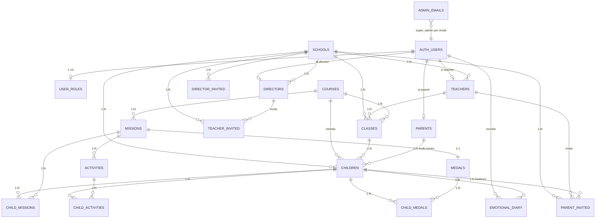
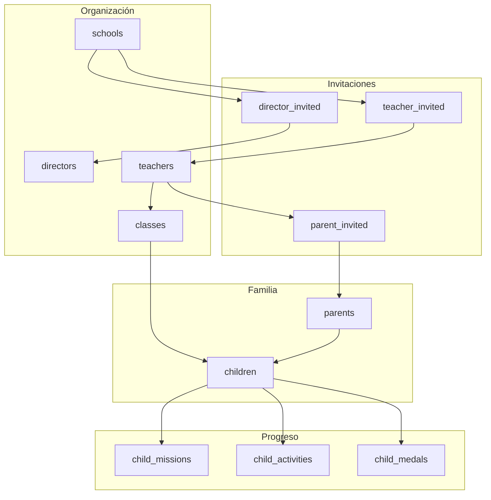

# ERD — BRAINI

**Versión:** 3.0  
**Esquema:** PostgreSQL `public` + `auth.users`  
**Proyecto Supabase:** BRAINI (`igwoavsazbycqmdweger`, eu-west-2)  
**Validación:** MCP `list_tables` — 19 tablas, todas con RLS

---

## 1. Diagrama entidad-relación

---

## 2. Convenciones

| Convención | Detalle |
|------------|---------|
| Invitaciones | `director_invited`, `teacher_invited`, `parent_invited` (no `*_invites`) |
| Super admin | `admin_emails` — no fila en `user_roles` |
| Menor sin cuenta | `children.parent_id` nullable hasta invitación padre |
| Catálogo | `missions`, `activities`, `medals` — inmutables en producción |

---

## 3. Cardinalidades clave

| Relación | Cardinalidad |
|----------|--------------|
| schools → directors | 1:N (varios directores/centro) |
| schools → teachers | 1:N |
| teachers → classes | 1:N |
| classes → children | 1:N |
| parents → children | 1:N (multi-centro) |
| children → parent_invited | 1:N histórico; 1 `pending` vigente |
| missions → activities | 1:N |
| missions → medals | 1:1 |
| courses → missions | 1:N |

---

## 4. Tablas por dominio

| Dominio | Tablas (19) |
|---------|-------------|
| Identidad (5) | `admin_emails`, `user_roles`, `parents`, `teachers`, `directors` |
| Organización (2) | `schools`, `classes` |
| Invitaciones (3) | `director_invited`, `teacher_invited`, `parent_invited` |
| Alumnado (1) | `children` |
| Catálogo (4) | `courses`, `missions`, `activities`, `medals` |
| Progreso (3) | `child_missions`, `child_activities`, `child_medals` |
| Diario (1) | `emotional_diary` |

Más `auth.users` (esquema `auth`, gestionado por Supabase Auth).

---

## 5. Flujo de datos del pipeline

---

## 6. Triggers que mantienen integridad

| Trigger | Efecto en el modelo |
|---------|-------------------|
| `children_sync_from_class` | `children` hereda contexto de `classes` |
| `classes_propagate_to_children` | Cambios de clase propagados a alumnos |
| `validate_class_course_nivel` | Integridad `courses` ↔ `nivel_educativo` |
| `setup_child` | Materializa progreso al crear alumno |
| `complete_mission` | Cierra misión y asigna medalla |

---

## 7. Referencia cruzada

- Campos y reglas: [07-MODELO-DE-DATOS](07-MODELO-DE-DATOS.md)
- RPC y Edge: [10-BACKEND-SUPABASE](10-BACKEND-SUPABASE.md)
- Permisos: [05-ROLES-Y-PERMISOS](05-ROLES-Y-PERMISOS.md)
