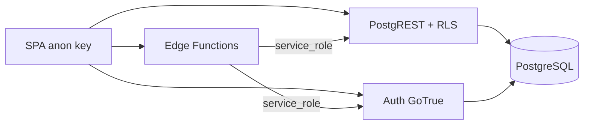

# Backend Supabase — BRAINI

**Versión:** 3.0  
**Proyecto:** BRAINI (`igwoavsazbycqmdweger`, eu-west-2, PostgreSQL 17.4)  
**Validación:** MCP solo lectura — julio 2026

---

## 1. Arquitectura backend



| Componente | Rol |
|------------|-----|
| Auth | Email/contraseña; sin signup público en cliente |
| PostgREST | CRUD con RLS por `auth.uid()` |
| RPC `SECURITY DEFINER` | Operaciones privilegiadas con validación interna |
| Edge Functions | Alta usuarios (`auth.admin.createUser`) + completar invitaciones |
| Storage | Assets emociones, actividades, documentos legales |

---

## 2. Cliente frontend

Ubicación: `src/integrations/supabase/client.ts`

```typescript
createClient(VITE_SUPABASE_URL, VITE_SUPABASE_ANON_KEY)
```

Tipos generados en `types/database.types.ts`. Queries encapsuladas en `queries/`, RPC en `rpc/`, llamadas Edge en `edge/invites.ts`.

---

## 3. Autenticación

| Flujo | Implementación |
|-------|----------------|
| Login | `signInWithPassword` |
| Recuperación | `resetPasswordForEmail` → redirect `/brainifamily/update-password` |
| Alta usuarios | Solo Edge + `auth.admin.createUser` (service role) |
| Rol post-login | RPC `get_my_role()` |

### `get_my_role()` — orden de resolución

1. `is_super_admin()` → `{ role: 'super_admin' }`
2. Fila en `user_roles` → `{ role, school_id }`
3. Sin rol → error / redirección login

---

## 4. Edge Functions (remoto)

| Función | Versión | `verify_jwt` | Estado |
|---------|---------|--------------|--------|
| `complete-director-invite` | v4 | `false` | ACTIVE |
| `complete-teacher-invite` | v2 | `false` | ACTIVE |
| `complete-parent-invite` | v5 | `false` | ACTIVE |

Código fuente en `supabase/functions/<nombre>/index.ts`.

### Flujo común (director / teacher)

1. Cliente envía `action: 'preview'` + `token`.
2. Edge llama RPC `get_*_invite_by_token`.
3. En `complete`: `auth.admin.createUser` → RPC `complete_*_invite`.
4. Rollback: `deleteUser` si RPC falla.

### `complete-parent-invite` — ramas

| Rama | Condición | Acción |
|------|-----------|--------|
| Preview | `action: 'preview'` | Devuelve invitación + escuela + hijo + detección cuenta |
| Cuenta nueva | Sin sesión / sin usuario | `createUser` → `complete_parent_invite` |
| Cuenta existente | Sesión JWT email = email invitación | `complete_parent_invite` sin `createUser` |

Variables Edge: `SUPABASE_URL`, `SUPABASE_ANON_KEY`, `SUPABASE_SERVICE_ROLE_KEY`.

---

## 5. Catálogo RPC (remoto verificado)

| RPC | Parámetros | Invocador | Propósito |
|-----|------------|-----------|-----------|
| `get_my_role` | — | Cliente auth | Rol + school_id |
| `is_super_admin` | — | Interno / cliente | Comprueba admin_emails |
| `email_platform_status` | `p_email` | RPC invitaciones | Validar email existente |
| `admin_create_school` | `p_name` | Super admin | Crear centro |
| `create_director_invite` | `p_school_id`, `p_email` | Super admin | Invitación director |
| `create_teacher_invite` | `p_school_id`, `p_email` | Director | Invitación teacher |
| `create_parent_invite` | `p_child_id`, `p_email` | Teacher | Invitación padre |
| `get_director_invite_by_token` | `p_token` | Edge / preview | Datos invitación |
| `get_teacher_invite_by_token` | `p_token` | Edge / preview | Idem |
| `get_parent_invite_by_token` | `p_token` | Edge / preview | + child_nombre |
| `complete_director_invite` | invite_id, user_id, email, nombre | Edge | Activar director |
| `complete_teacher_invite` | idem | Edge | Activar teacher |
| `complete_parent_invite` | idem | Edge | Activar/vincular padre |
| `upsert_emotional_diary` | user_id, child_id, emotions, obs, date | Padre | CRUD diario |
| `teacher_owns_child` | `p_child_id` | RLS helper | Ámbito teacher |
| `director_in_child_school` | `p_child_id` | RLS helper | Ámbito director |
| `auth_current_user_email_lower` | — | RLS helper | Email sesión |

Funciones trigger (no RPC públicas de negocio): `children_sync_from_class`, `classes_propagate_to_children`, `validate_class_course_nivel`, `setup_child`, `complete_mission`, `set_updated_at`.

---

## 6. RLS — estado en remoto

**Todas las 19 tablas** tienen `rls_enabled: true`.

### Implementado (verificado MCP)

| Área | Políticas destacadas |
|------|---------------------|
| `children` | Padre CRUD; teacher INSERT/SELECT/UPDATE pre-vincular; director por centro; super_admin ALL |
| `classes` | Teacher CRUD propias; director por centro |
| `child_*` + `emotional_diary` | Padre escribe; teacher/director SELECT vía helpers; super_admin ALL |
| Invitaciones | Por rol: super_admin, director, teacher según ámbito |
| Catálogo | SELECT autenticados; sin escritura para roles plataforma |

### Divergencia con docs v2.0

La documentación antigua (`08-TDD.md`) listaba como **pendiente** el SELECT de teacher/director en tablas de progreso. En el remoto actual **ya está implementado** (`child_*_select_teacher`, `*_select_director`, `emotional_diary_select_*`).

---

## 7. Advisors de seguridad (MCP)

Avisos relevantes del linter Supabase (julio 2026):

| Aviso | Nivel | Implicación |
|-------|-------|-------------|
| RPC `SECURITY DEFINER` ejecutables por `authenticated`/`anon` | WARN | Patrón esperado; las funciones validan permisos internamente. Revisar `GRANT EXECUTE` en endurecimiento futuro. |
| `setup_child` ejecutable por `anon` | WARN | Debería ser solo trigger; considerar revocar EXECUTE público. |
| Auth OTP expiry > 1 hora | WARN | Ajustar en dashboard Auth |
| Leaked password protection deshabilitado | WARN | Habilitar HaveIBeenPwned en Auth |
| Postgres 17.4.1.064 con parches pendientes | WARN | Planificar upgrade |

---

## 8. Storage

Buckets públicos (constantes en `shared/lib/constants/`):

| Bucket / path | Uso |
|---------------|-----|
| Emociones infantil/primaria | Iconos diario emocional |
| Assets actividades | Medios pedagógicos |
| Documentos legales | Avisos privacidad |

Acceso desde cliente con anon key; políticas de Storage en Supabase dashboard.

---

## 9. Validación de invitaciones

`create_*_invite` y Edge Functions validan:

- Token UUID único.
- `expires_at` = now() + 15 días.
- Estados: `pending` → `completed` | `expired` | `revoked`.
- `email_platform_status(p_email)` antes de generar (rechazar roles incompatibles; permitir parent para multi-hijo).

---

## 10. Gaps conocidos

| Gap | Detalle | Doc |
|-----|---------|-----|
| Migraciones en repo | No hay `supabase/migrations/` versionadas | [13-ESTADO-ACTUAL](13-ESTADO-ACTUAL.md) |
| `GRANT EXECUTE` amplio | Advisors sugieren restringir RPC sensibles | Este doc §7 |
| Emails automáticos | Fuera de alcance v2.0; enlace manual | [04-VISION](04-VISION-Y-ALCANCE-B2B.md) |

---

## 11. Reglas MCP para mantenimiento doc

Al actualizar este documento:

- Usar MCP `list_tables`, `execute_sql`, `list_edge_functions`, `get_advisors` en **solo lectura**.
- No `apply_migration`, no desplegar Edge, no modificar RLS remoto desde documentación.
- Si el remoto diverge del repo, documentar la realidad del remoto.

---

## 12. Referencias

- Modelo: [07-MODELO-DE-DATOS](07-MODELO-DE-DATOS.md)
- ERD: [08-ERD](08-ERD.md)
- Permisos: [05-ROLES-Y-PERMISOS](05-ROLES-Y-PERMISOS.md)
- Cliente: [09-DISENO-TECNICO-FRONTEND](09-DISENO-TECNICO-FRONTEND.md)
