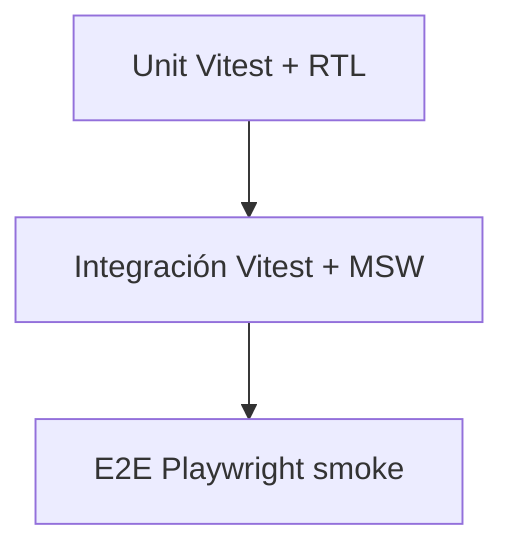

# Testing y calidad — BRAINI

**Versión:** 3.0  
**Baseline:** julio 2026, rama `develop`

---

## 1. Pirámide de testing



| Capa | Herramienta | Alcance |
|------|-------------|---------|
| Unit / integración | Vitest + React Testing Library + MSW | `src/**/*.test.ts(x)` |
| E2E smoke | Playwright | Rutas públicas, redirects legacy, guards sin auth |
| E2E autenticado | Playwright (opcional) | `.env.test` + staging |

---

## 2. Estructura de tests

```
src/**/*.test.ts(x)     # Tests junto al código
tests/
├── setup/              # Vitest, MSW handlers, test-utils
├── fixtures/           # Datos fake
└── e2e/
    ├── playwright.config.ts
    └── smoke/          # Suite rápida pre-push
```

**Híbrido:** tests unitarios viven junto al módulo; infra compartida en `tests/setup/`.

---

## 3. Scripts

| Script | Qué ejecuta |
|--------|--------------|
| `npm run test` | Vitest watch |
| `npm run test:run` | Vitest una pasada (CI) |
| `npm run test:coverage` | Cobertura v8 |
| `npm run test:e2e` | Playwright completo |
| `npm run test:e2e:smoke` | Solo `tests/e2e/smoke/` |
| `npm run verify` | `lint` + `test:run` + `build` |
| `npm run analyze` | Build + `stats.html` (bundle visualizer) |

**Gate pre-push recomendado:** `npm run verify` + `npm run test:e2e:smoke`.

---

## 4. Vitest + MSW

- Config: `vitest.config.ts` — entorno `jsdom`, setup en `tests/setup/`.
- MSW intercepta llamadas a Supabase; **no toca el remoto** en tests unitarios.
- Ejemplos con tests: `integrations/supabase/queries/*.test.ts`, `rpc/roles.test.ts`, hooks `useMissions.test.tsx`.

Patrón:

1. Montar componente o función con RTL.
2. MSW devuelve fixtures de `tests/fixtures/`.
3. Assert sobre UI o resultado sin red real.

---

## 5. Playwright E2E smoke

Config: `tests/e2e/playwright.config.ts`.

**Smoke** (`tests/e2e/smoke/`) verifica sin autenticación:

- Landings cargan (`/`, `/brainikids`, `/brainifamily`).
- Redirects legacy (`/login` → `/brainifamily/login`, `/signup` → login).
- Rutas eliminadas no accesibles (CA-OUT-01).
- Guards redirigen sin sesión.

**E2E autenticado (opcional):** copiar `.env.test.example` → `.env.test` con credenciales de staging.

---

## 6. Baseline de rendimiento (bundle)

**Fecha referencia:** 2026-07-15 · **Node:** 22.17.0 · **Rama:** develop

### Post Fase 1 (lazy routes + registry)

| Asset | Tamaño aprox. |
|-------|----------------|
| `dist/assets/index-*.js` | ~107 KB |
| `dist/assets/vendor-react-*.js` | ~143 KB |
| `dist/assets/vendor-supabase-*.js` | ~173 KB |
| `dist/assets/vendor-radix-*.js` | ~142 KB |
| `dist/assets/activities-puzzles-*.js` | ~211 KB (lazy) |
| `dist/assets/index-*.css` | ~120 KB |

### Baseline Fase 0 (pre-optimización)

- `index-*.js` monolítico: **~1.1 MB**

### Objetivos

| Métrica | Objetivo |
|---------|----------|
| JS bundle inicial | < 400 KB sin gzip |
| Lazy routes | ✓ implementado |
| Lazy puzzles en ActivityDetail | ✓ implementado |

Regenerar métricas: `npm run build` o `npm run analyze` → `stats.html`.

---

## 7. Lint y TypeScript

| Herramienta | Estado |
|-------------|--------|
| `tsc --noEmit` | Pasa limpio |
| ESLint 9 | Activo; deuda en `@typescript-eslint/no-explicit-any` (~25 avisos legacy) |

`npm run verify` incluye lint; ver gap en [13-ESTADO-ACTUAL](13-ESTADO-ACTUAL.md).

---

## 8. Artefactos ignorados

En `.gitignore`: `coverage/`, `playwright-report/`, `test-results/`, `stats.html`, `dist/`.

---

## 9. Cobertura actual (referencia)

Según última verificación en `develop`:

- **28** tests unit/integración (Vitest).
- **26** tests E2E smoke (Playwright).

Ejecutar `npm run test:run` y `npm run test:e2e:smoke` para cifra actualizada.

---

## 10. Checklist de calidad por fase

| Fase | Comandos mínimos |
|------|------------------|
| Desarrollo local | `npm run test` (watch) |
| Pre-commit / pre-push | `npm run verify` + `npm run test:e2e:smoke` |
| Release | + `npm run test:e2e` completo si hay `.env.test` |
| Optimización bundle | `npm run analyze` |

Criterios de negocio verificables: [12-CRITERIOS-DE-ACEPTACION](12-CRITERIOS-DE-ACEPTACION.md).

---

## 11. Siguiente lectura

- [09-DISENO-TECNICO-FRONTEND](09-DISENO-TECNICO-FRONTEND.md) — estructura bajo test.
- [13-ESTADO-ACTUAL](13-ESTADO-ACTUAL.md) — gaps lint, migraciones.
